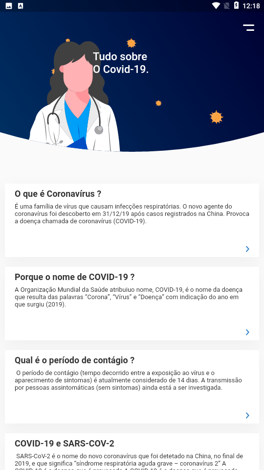

# APP Covid19
é uma aplicação que desenvolve utilizado  o Flutter. Foi uma experiencia muito divertida até porque foi o meu primeiro contacto com o desenvolvimento mobile.

## Ferramentas que usei

- Dart(Flutter)

## Imagens do projecto:

### - Tela Inicial

### - Menu principal

